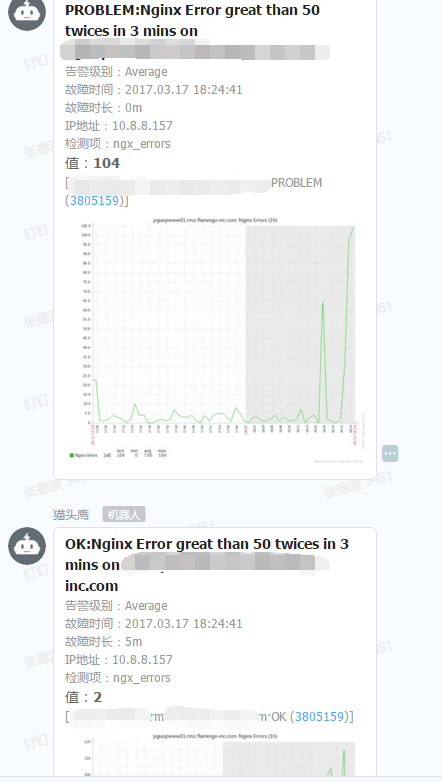

#Zabbix alert to Dingtalk

#Zabbix告警发送到钉钉

##Config

- Action

    Default subject
    ```
    {TRIGGER.STATUS}: {TRIGGER.NAME}
    ```
    Default message
    ```
    <?xml version="1.0" encoding="utf-8"?><root><from>{HOSTNAME1}</from><time>{EVENT.DATE} {EVENT.TIME}</time><level>{TRIGGER.SEVERITY}</level><name>{TRIGGER.STATUS}:{TRIGGER.NAME}</name><key>{TRIGGER.KEY1}</key><value>{ITEM.VALUE}</value><now>{ITEM.LASTVALUE}</now><id>{EVENT.ID}</id><ip>{HOST.IP}</ip><url>http://zabbix.com/tr_events.php?triggerid={TRIGGER.ID}&amp;eventid={EVENT.ID}</url><age>{EVENT.AGE}</age><itemid>{ITEM.ID}</itemid><status>{EVENT.STATUS}</status><acknowledgement>{EVENT.ACK.STATUS}</acknowledgement><acknowledgementhistory>{EVENT.ACK.HISTORY}</acknowledgementhistory></root>
    ```
    Recovery subject
    ```
    {TRIGGER.STATUS}: {TRIGGER.NAME}
    ```
    Recovery message
    ```
    <?xml version="1.0" encoding="UTF-8" ?><root><from>{HOSTNAME1}</from><time>{EVENT.DATE} {EVENT.TIME}</time><level>{TRIGGER.SEVERITY}</level><name>{TRIGGER.STATUS}:{TRIGGER.NAME}</name><key>{TRIGGER.KEY1}</key><value>{ITEM.VALUE}</value><now>{ITEM.LASTVALUE}</now><id>{EVENT.ID}</id><ip>{HOST.IP}</ip><color>FF4A934A</color><url>http://zabbix.com/tr_events.php?triggerid={TRIGGER.ID}&amp;eventid={EVENT.ID}</url><age>{EVENT.AGE}</age><itemid>{ITEM.ID}</itemid><recoveryTime>{EVENT.RECOVERY.DATE} {EVENT.RECOVERY.TIME}</recoveryTime><status>{EVENT.RECOVERY.STATUS}</status></root>
    ```
- Media Type

    Script parameters

    ```
    https://oapi.dingtalk.com/robot/send?access_token=your_token

    {ALERT.SUBJECT}

    {ALERT.MESSAGE}
    ```

    Script name
    <code>dingding.sh</code>
    ```
    cat dingding.sh
    #!/bin/bash
    export PATH=/usr/local/java/bin:/bin:/usr/bin:/usr/local/bin:/sbin:/usr/sbin:/usr/local/sbin:/usr/local/go/bin:/usr/local/php/bin
    webhook=$1
    subject=$2
    msg=$3
    cd /usr/local/zabbix/alertscripts/dingtalk
    python sender.py $webhook "${subject}" "${msg}"
    ```

- Show case

    
